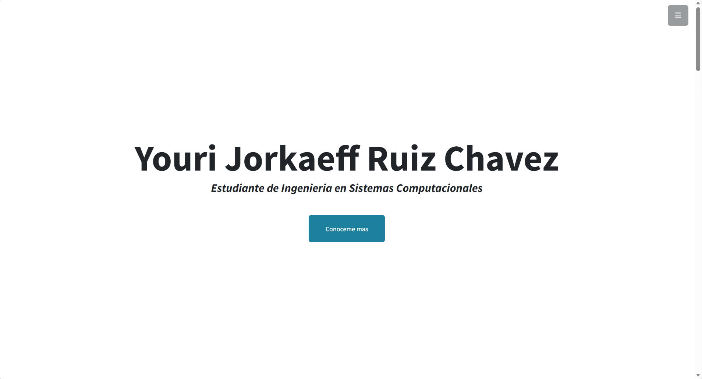
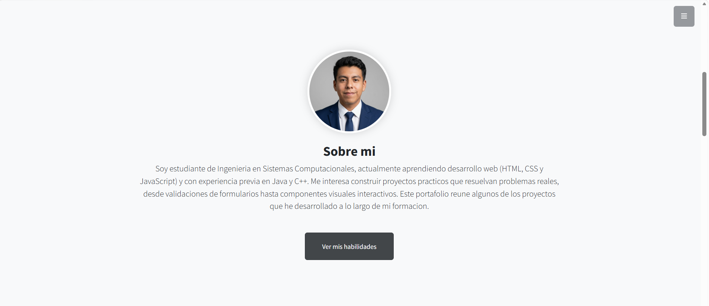
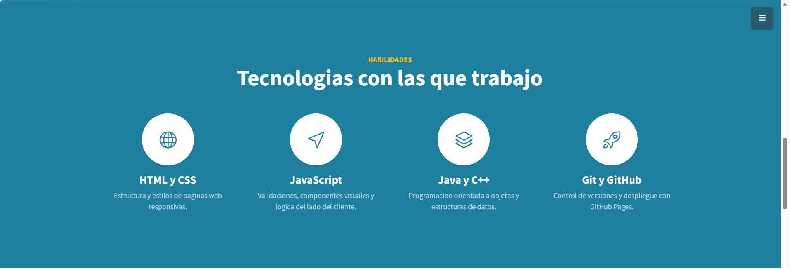
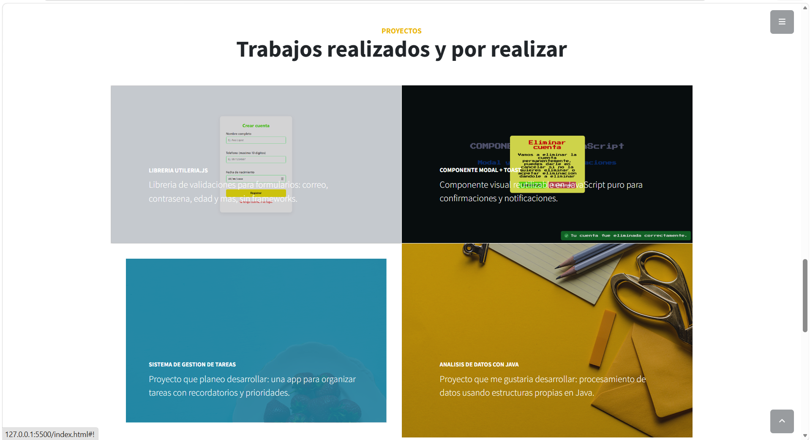

# Portafolio Web

**Alumno:** Ruiz Chavez Youri Jorkaeff

## Portada

Este es mi portafolio web personal, hecho con HTML, CSS y JavaScript, usando Bootstrap como base de estilos. Lo construí a partir de una plantilla gratuita, y lo fui adaptando con mi información, mis habilidades y los proyectos que he hecho (y algunos que todavía quiero hacer) a lo largo de la materia de Programación Web.

## Descripción del proyecto

Usé **Bootstrap** (no Tailwind) como framework de estilos, a través de la plantilla gratuita **Stylish Portfolio** de Start Bootstrap, que se puede descargar aquí:

<https://startbootstrap.com/theme/stylish-portfolio/>

Elegí esta plantilla en particular porque es de una sola página con scroll (one page), tiene un menú lateral desplegable que se ve distinto al típico menú superior, y ya trae una estructura pensada para un portafolio personal, con secciones bien separadas.

El sitio está dividido en las siguientes secciones:

- **Inicio:** lo primero que se ve al entrar, con mi nombre y una breve descripción de quién soy (estudiante de Ingeniería en Sistemas Computacionales).
- **Sobre mí:** aquí agregué mi foto de perfil (la plantilla original no traía espacio para foto, así que tuve que agregarlo yo mismo con una imagen circular y un poco de CSS extra) junto con un párrafo contando en qué estoy enfocado actualmente.
- **Habilidades:** una sección con 4 tarjetas mostrando las tecnologías con las que trabajo o estoy aprendiendo: HTML/CSS, JavaScript, Java/C++, y Git/GitHub.
- **Proyectos:** una galería con 4 proyectos. Dos son reales, de esta misma materia (mi librería `utileria.js` de la Actividad 2, y mi componente Modal + Toast de la Actividad 3), y los otros dos son proyectos que todavía no he hecho pero que me gustaría desarrollar más adelante (un sistema de gestión de tareas, y un proyecto de análisis de datos con Java), tal como permitía el enunciado si no se tienen suficientes proyectos reales todavía.
- **Contacto:** mi correo y el link a mi perfil de GitHub, para que cualquiera pueda contactarme o revisar mis demás repositorios.

## Proceso de creación

Así fue como armé el portafolio paso a paso:

1. Descargué el ZIP de la plantilla desde el repositorio oficial de Start Bootstrap en GitHub.
2. Dentro del ZIP, encontré que la plantilla ya traía una carpeta `dist` con la versión lista para usar (HTML, CSS y JS ya compilados), así que tomé los archivos de ahí en vez de los archivos fuente en formato Pug/Sass, que requieren herramientas adicionales para compilarse.
3. Reorganicé los archivos según la estructura que pedía la actividad: moví el CSS a `css/portafolio.css`, el JS a `js/portafolio.js`, y las imágenes a la carpeta `img`, corrigiendo las rutas dentro del HTML para que apuntaran a los nombres y carpetas nuevas.
4. Noté que la sección "About" de la plantilla original no tenía ningún espacio para una foto, solo texto. Agregué yo mismo una etiqueta `` ahí, y le escribí una clase CSS nueva (`.img-perfil`) al final de mi archivo de estilos, para que la foto se viera como un círculo centrado, con un borde blanco y una sombra suave.
5. Reemplacé todos los textos de ejemplo en inglés (nombre genérico, "Lorem ipsum", servicios inventados tipo "Responsive", "Redesigned") por mi información real: mi nombre, una descripción de mí mismo, y mis habilidades.
6. La sección "Services" de la plantilla la reconvertí en una sección de "Habilidades", cambiando los íconos y los textos para que reflejaran tecnologías reales en vez de los ejemplos genéricos de la plantilla.
7. En la sección de portafolio, cambié los 4 proyectos de ejemplo (que hablaban de cosas como "Ice Cream" o "Strawberries") por mis propios proyectos, dejando por ahora las imágenes de muestra que traía la plantilla, ya que todavía no tengo capturas propias de todos.
8. La plantilla original traía un mapa de Google incrustado apuntando a una dirección en San Francisco que no tenía nada que ver conmigo. Eliminé esa sección por completo y la reemplacé por una sección de contacto simple, con mi correo y mi GitHub.
9. Por último, probé todo localmente con XAMPP antes de subirlo, revisando que la foto cargara bien, que el menú lateral funcionara, y que no hubiera errores en la consola del navegador.

## Capturas de pantalla

## Demo en vivo

<https://youri22-eng.github.io/Actividad4_portafolio/>